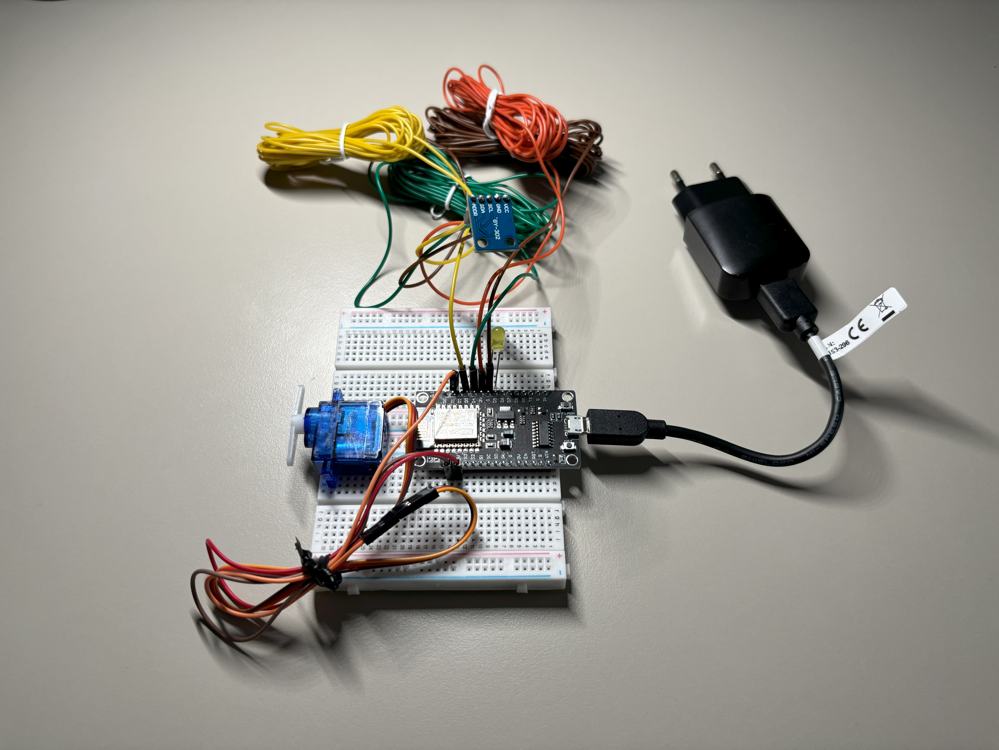
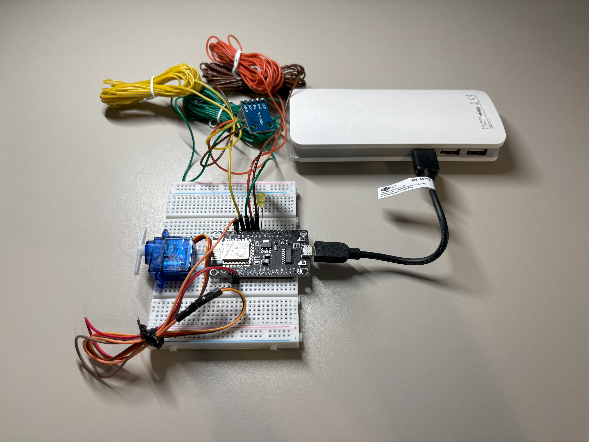
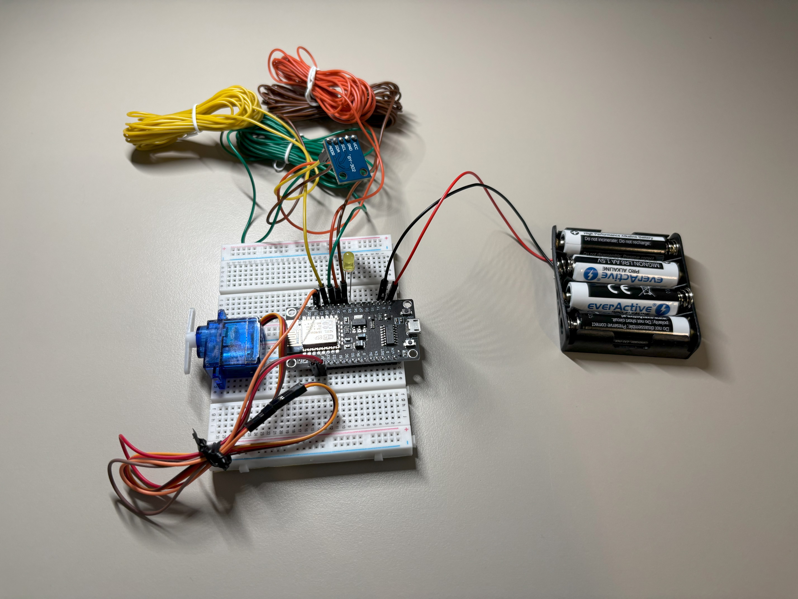
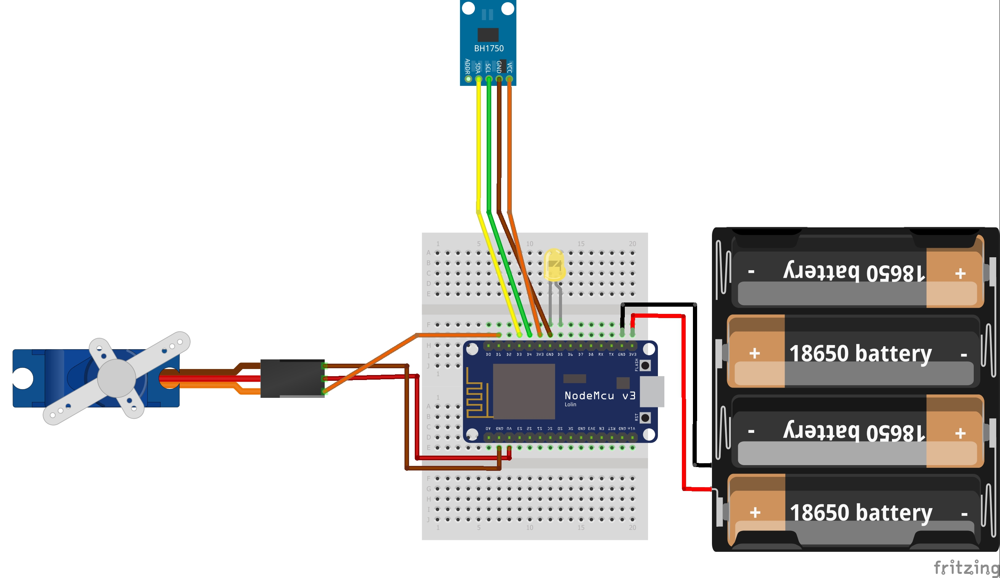

# Smart Single-Light Switch 1.1
This project aims to create a Smart Single-Light Switch controlled via phone/computer/tablet using wifi with light monitoring.
<p align="center"></p>

## YouTube tutorial
<a href="https://youtube.com/shorts/5B9hfxMmvcQ?feature=share3">Click here to see video tutorial </a>

## Previous YouTube tutorial (watch it before moving to this tutorial)
<a href="https://youtu.be/bshRV9Qr4Ys">Click here to see previous video tutorial</a>

## Sketch

<p align="center"></p>

Sketch made using <a href="https://fritzing.org/">(Fritzing Software)</a>

<p align="center"></p>

## Used Hardware
- [WiFi Module ESP8266 + NodeMCU v3](https://botland.com.pl/moduly-wifi-esp8266/8241-modul-wifi-esp8266-nodemcu-v3-5904422300630.html)

<p align="center"></p>

<p align="center"></p>

<p align="center"></p>

- [Light sensor BH1750](https://botland.com.pl/czujniki-swiatla-i-koloru/2024-czujnik-natezenia-swiatla-bh1750-5904422373283.html)

<p align="center"></p>

- [Serwo SG-90 - micro - 180 degrees](https://botland.com.pl/serwa-typu-micro/13128-serwo-sg-90-micro-180-5904422350338.html)

<p align="center"></p>

<p>*we will use double-arm servo horn</p>

<p align="center"></p>

- [LED Diode 5mm](https://botland.com.pl/diody-led/13606-dioda-led-5mm-zolta-10szt-5903351244244.html)

<p align="center"></p>

- [Set of long PVC wires / cables](https://botland.store/pvc-cables/13012-velleman-k-mow-set-of-pvc-wire-cable-10-colors-60m-5410329217679.html)

<p align="center"></p>

Wires / cables can be delivered without pre-installed connectors (like above) — in that case you can use male pin rasters (or female if you plan to connect the BH1750 directly to your microcontroller instead of a breadboard) and BLS connectors to create the connectors yourself.

- [Male Pin Raster](https://botland.store/bls-connectors/4776-male-pin-for-case-socket-raster-25mm-10pcs-5904422303181.html)

<p align="center"></p>

- [Female Pin Raster](https://botland.store/bls-connectors/4903-female-pin-for-case-raster-254mm-10pcs-5904422303204.html)

<p align="center"></p>
  
- [BLS connectors](https://botland.com.pl/zlacza-bls/5204-zlacze-typu-bls-gniazdo-1x1-5szt-5904422353599.html)

<p align="center"></p>

- [Wires (male-to-male, female-to-female and men-to-female)](https://botland.com.pl/przewody-polaczeniowe/19946-zestaw-przewodow-polaczeniowych-justpi-20cm-3x40szt-m-m-z-z-m-z-120szt-5904422328702.html)

<p align="center"></p>

- [2 x Breadboard](https://botland.store/breadoards/19942-breadboard-justpi-400-holes-5904422328627.html)

<p align="center"></p>

- Micro USB cable

<p align="center"></p>

## Power
### Version with charger
<p align="center"></p>

- Charger

<p align="center"></p>

### Version with powerbank
<p align="center"></p>

- Standard powerbank

<p align="center"></p>

### Version with batteries
<p align="center"></p>
<p align="center"></p>

- [4 x AA (R6 LR6) alkaline battery](https://botland.store/batteries/9343-everactive-pro-aa-r6-lr6-alkaline-battery-4pcs-5903205770974.html)

<p align="center"></p>

- [Battery holder - 4 x AA (R6)](https://botland.store/battery-holders/173-battery-holder-4-x-aa-r6-5904422329389.html)

<p align="center"></p>

Similar to long wires, a battery basket can be delivered without pre-installed connectors (like above) — in that case you can use male pin rasters (or female if you plan to connect the batteries directly to your microcontroller instead of a breadboard) and BLS connectors to create the connectors yourself.

### Version without diode
You can delete the ```blinkLed()``` function along with its calls, as well as the following lines:
```c
#define LED_PIN D5  
```
```c
pinMode(LED_PIN, OUTPUT);
```

### Version without breadboard
You can also connect components directly without using breadboard.

## Accesing the web page
Type 192.168.4.1 address in you browser to control your device.

You can add a webpage shortcut to your phone’s home screen for quick access.

<p align="center"></p>

## Hardware Documentation
- [NodeMCU](https://nodemcu.readthedocs.io/en/release/)
- [Servo](http://www.datasheet-pdf.com/PDF/SG90-Datasheet-TowerPro-791970)
- [BH1750 Module](https://nodemcu.readthedocs.io/en/release/lua-modules/bh1750/)

## Software Documentation
- [github.com/esp8266/Arduino](https://github.com/esp8266/Arduino)
- [docs.arduino.cc](https://docs.arduino.cc/)
  - [docs.arduino.cc/programming](https://docs.arduino.cc/programming/)
  - [docs.arduino.cc/libraries](https://docs.arduino.cc/libraries/) 

## Used Tools
- <a href="https://fritzing.org/">Fritzing Software</a>
    - <a href="https://github.com/roman-miniailov/nodemcu-v3-fritzing">NodeMCUv3 Wifi ESP86266</a> component
    - <a href="https://robdomo.com/ressources/fritzing-parts/tower-pro-sg90-servo/">Serwo SG-90</a> component
    - <a href="https://forum.fritzing.org/t/bh1750-light-itensity-sensor-part-submit/18518">BH1750</a> component
- <a href="https://cloud.arduino.cc/">Arduino Cloud - Online Editor</a>
    - <a href="https://docs.arduino.cc/arduino-cloud/hardware/cloud-agent/">Arduino Cloud Agent</a> - it is a required plugin that enables serial communication between your board and the Arduino Cloud accessed via your web browser

## My recommendations and tips
1. The angles in the following code assume that the servo motor is mounted with its sticker facing the breadboard. If the mounting orientation is different, the movement directions may need to be adjusted (possibly requiring swapping 60 and 120 degrees).

```c
  if (signal == "on") {         // If the signal says "on"
    blinkLed();                 // Blink LED diode to indicate action
    servoMotor.write(90);       // Move servo to 90 degrees
    delay(500);                 // Wait 500ms
    servoMotor.write(120);      // Move servo to 120 degrees (or 60 degrees)
    delay(500);                 // Wait 500ms
    servoMotor.write(90);       // Return to 90 degrees
  } 
  else if (signal == "off") {   // If the signal says "off"
    blinkLed();                 // Blink LED diode to indicate action
    servoMotor.write(90);       // Move servo to 90 degrees
    delay(500);                 // Wait 500ms
    servoMotor.write(60);       // Move servo to 60 degrees (or 120 degrees)
    delay(500);                 // Wait 500ms
    servoMotor.write(90);       // Return to 90 degrees
  }
```
2. Keep in mind that if you plan to power your device using a ```powerbank```, it won’t work without the LED diode. That’s because the microcontroller and servo together don’t draw enough power, causing a standard powerbank to quickly shut off, assuming there’s nothing to power.
To make the powerbank solution work, we need to make one small adjustment in our code: the LED diode should stay on continuously to create enough power demand and only blink when a signal is received. I’ve already implemented this solution in the code (you can find it within comments) so you don’t have to write it yourself.

```TIP: You can trick the powerbank in a different way by making the LED diode blink every x seconds. Give it a try!```

3. If the upload fails, the issue might be an old micro USB cable. Even if the cable looks fine, it could be damaged internally. I had this issue before so I bought a completely new micro USB cable and it solved all of my problems.
4. If you get a port busy error, you can open a Device Manager, find Ports (COM & LPT), locate your device, and disable & enable the driver. This should solve the issue.

## Resources and Inspiration
<a href="https://electechoz.blogspot.com/2022/01/esp8266-webserver-controller-servo-motor.html">Eleco Techoz</a>
